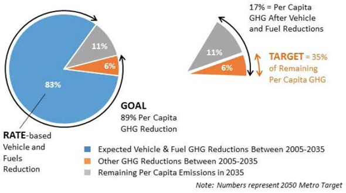
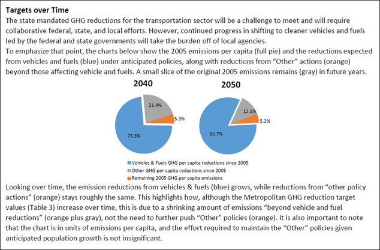
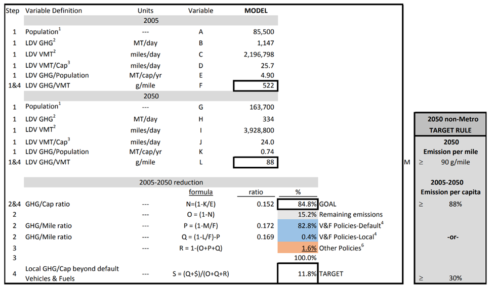

# Future Scenario – Tracking progress to the GHG Target Rule {#chapter6}

## Overview

A Preferred Scenario is an agreed-to set of transportation policies and investments that enables the metropolitan area to meet their GHG reduction goal relative to 2005 (Oregon Revised Statutes Chapter 660, Division 44 Metropolitan Greenhouse Gas Reduction Targets). The scenario should be calibrated to meet or exceed GHG reduction targets within the model,

In tracking whether the preferred or any alternative scenario meets the Target Rule there are special things to consider related to VisionEval inputs:

-   State-led inputs:

    -   STS Vehicles-Fuels. The set of inputs around the types of vehicles, the powertrains and fuels of those vehicles.

    -   Other State led inputs. These are policies and investments beyond vehicles and fuels to include pricing and system operations.

-   Uncertainties. Some forecast assumptions which have changed since the target rule was set.

-   Model set-up. Some model-set-up files consistent between the state and regional VisionEval models, Local or Regional inputs and polices. These should be in alignment with the regional plans.

## State Led target rule Inputs

The MPO GHG Target Rule (OAR 660-044) is a metric to determine Greenhouse Gas (GHG) reductions from local policies relative to a historical year. The Target Rule specifies that metropolitan areas, when evaluating their progress towards the GHG reduction target, may take credit for allowable state-led actions found in the Statewide Transportation Strategy (STS). These ***state-led actions*** go beyond the Vehicle and Fuel programs and include a variety of pricing actions and system operations programs.

While initiated at the federal and state level, these policies and programs are unlikely to be successfully adopted or implemented without support from local communities. By including these state-led actions in the Target Rule metric the **local agency is lending their community support** to advancing these policies and programs in meeting statewide GHG reduction goals. Metropolitan areas are asked to identify which policies and programs the region supports from the list of state-led policies and actions. Absent local support for these state-led actions, metropolitan areas are allowed to propose an alternative set of policy actions in an attempt to reach the target requirement.

Absent local support for these state-led actions, metropolitan areas are allowed to propose an alternative set of policy actions in an attempt to reach the target requirement.

Files denoted by (TR) are target rule specific versions of the input file, reflecting model inputs assumed at the time the target was set, such as fuel price and income forecasts. For tracking progress on the GHG target, the region is allowed to assume either current assumptions or these ”TR” model assumptions.

**Table 14: VisionEval Input files of state-led policies and actions**

| **State-led Actions** |||
|---------------------------------------------------------------------------------------------|-------------------------------------------------------------------------|------------------------------------|
| **Policy or Action**                                                                                  | **RSPM File (VE-State File)**                                 | **Description**                        |
| ***Vehicles and Fuels***                                                                                                               |                                      |                                    |
| Household vehicle characteristics   | Age, fuel type, powertrain, % light truck | PowertrainsAndFuelsxSTSRecOnRoad package, azone\_hh\_veh\_mean\_age.csv, azone\_hh\_lttrk\_prop.csv |
| Commercial service vehicle characteristics | Age, fuel type, powertrain, % light truck, CNG/RNG | region\_hvyrk\_powertrain\_prop.csv, region\_comsvc\_powertrain\_prop.csv, region\_comsvc\_veh\_mean\_age.csv, region\_comsvc\_lttrk\_prop.csv  |
| Car service/TNC Vehicle attributes, Service Quality | Rates, vehicles, fleet age, access times, local restrictions | region\_carsvc\_powertrain\_prop.csv, azone\_carsvc\_characteristics.csv, azone\_vehicle\_access\_times.csv |
| Fuel | Carbon intensity standards and prices | (TR)region\_ave\_fuel\_carbon\_intensity.csv, (TR)azone\_fuel\_power\_cost.csv |
| Electricity | Carbon intensity standards and prices | azone\_electricity\_carbon\_intensity.csv |
| ***Pricing***                                                                                                                   |                                      |                                    |
| Pricing and fee programs | State & federal gas tax/OreGo, VMT fee, vehicle registration fees, congestion charges, PAYD insurance, Social and Carbon cost recovery pricing | azone\_veh\_use\_taxes.csv, azone\_hh\_veh\_own\_taxes.csv, marea\_congestion\_charges.csv, region\_prop\_externalities\_paid.csv, region\_co2e\_costs.csv |
| ***System Operations/Fuel Efficiency Programs*** | | |
| Freeway & Arterial Operations programs | Freeways: incident response, ramp metering, active traffic management. Arterials: signal coordination, access management, active traffic management | marea\_operations\_deployment.csv, marea\_speed\_smooth\_ecodrive.csv |
| EcoDrive programs | Personal and commercial vehicle participation | marea\_speed\_smooth\_ecodrive.csv |
| ***Model Set Up***                                                                                                                   |                                      |                                    |
|  | other\_ops\_effectiveness.csv, region\_road\_cost.csv, region\_hh\_ave\_driver\_per\_capita.csv, azone\_hh\_ave\_veh\_per\_driver.csv, azone\_relative\_employment.csv | region\_base\_year\_dvmt.csv, marea\_base\_year\_dvmt.csv, marea\_dvmt\_split\_by\_road\_class.csv, deflators.csv, units.csv, model\_parameters.json, run\_model.R |

### Vehicles and Fuels

***PowertrainsAndFuelsSTSRecOnRoad package***

This package must be called in the run\_model.R script, defs, and model\_parameters.json input file.

***Azone\_hh\_veh\_mean\_age***

Provides information on average vehicle age for light-duty vehicles including autos and light-trucks.

***Azone\_hh\_lttrk\_prop***

Specifies the proportion of vehicles that are light-trucks within the light-duty vehicle fleet.

***Region\_hvytrk\_powertrain\_prop***

This optional file is used to specify the powertrain proportion of heavy duty trucks.

***Region\_comsvc\_powertrain\_prop***

An optional file that specifies the powertrain proportion of commercial vehicles.

***Region\_comsvc\_veh\_mean\_age***

Average age of commercial service vehicles.

***Region\_comsvc\_lttrk\_prop***

Light truck proportion of commercial service vehicles.

***Region\_carsvc\_powertrain\_prop***

Proportion of powertrains for car service vehicles. This is an optional file.

***Azone\_carsvc\_characteristics***

Specifies characteristics for high and low levels of car service.

***Azone\_vehicle\_access\_times***

Provides information on vehicle access and egress times.

***Region\_ave\_fuel\_carbon\_intensity***

Specifies the average carbon intensity by vehicle type. This is an optional file.

***Azone\_fuel\_power\_cost***

Provides data on cost of retail fuel and electricity used in vehicles.

***Azone\_electricity\_carbon\_intensity***

Specifies the carbon intensity of electricity. This is an optional file.

### Pricing

***azone\_veh\_use\_taxes***

Provides information on vehicle-related taxes.

***Azone\_hh\_veh\_own\_taxes***

Provides data on flat fees, taxes, or ad valorem taxes on vehicles.

***Marea\_congestion\_charges***

Specifies the charges on vehicle travel for different levels of congestion.

***Azone\_payd\_insurance\_prop***

Specifies proportion of households using PAYD (pay-as-you-drive) insurance.

***Region\_prop\_externalities\_paid***

Accounts for costs due to climate change and social costs.

***Region\_co2e\_costs***

Accounts for the environmental and social costs of CO2e emissions in USD per metric ton. This is an optional file.

### System Operations and Fuel Efficiency Programs

***marea\_operations\_deployment***

Specifies the proportion of DVMT that is affected by operations on different road classes. This is an optional file.

***Marea\_speed\_smooth\_ecodrive***

Provides data on speed smoothing and ecodriving by both road class and vehicle type.

### Model Set-up

***other\_ops\_effectiveness***

Specifies the delay effects of operations in different road classes. This is an optional file.

***Region\_road\_cost***

Supplies data for road costs by type.

***azone\_relative\_employment***

Provides information on ratio of workers to persons by age.

***Region\_base\_year\_dvmt***

Provides data on base year DVMT for heavy trucks in the model region. This file may need to be adjusted if the model uses a base year that is not 2010.

***Marea\_base\_year\_dvmt***

Specifies adjustments to DVMT growth factors. This is an optional file.

***Marea\_dvmt\_split\_by\_road\_class***

Specifies the DVMT split for different road types. This is an optional file.

***deflators***

Defines annual deflator values. This includes CPI, which is used to convert currency values between years.

***units***

Defines the default units used in the model. This file should not be modified by the user.

***model\_parameters.json***

A json file that contains parameters for the following: AnnVmtInflator, BaseCostPerMile, DvmtBudgetProp, FuelCost, KwhCost, GasTax, LtTruckPrp, TranRevMiAdjFactor, TruckVmtGrowthMultiplier, and WorkVmtProp.

## Regionally Led Target Rule Inputs

Beyond the state-led input noted above, future scenarios include the following regionally-led policy inputs for use in the VisionEval model, there are no target-rule considerations on these inputs. Table 15 shows files that should be specified by MPOs and local jurisdictions. Files denoted “TR” use Target Rule files have the option of using the assumptions at the time the rule was set, as noted in the prior section. ODOT and DLCD will review these regionally led input files for consistency with other plans, state assumptions, and alignment with regional plans in the Preferred Scenario to be adopted by the region.

**Table 15: VisionEval STS – Monitoring Policies and Actions**

| **Local Actions & Assumptions** |||
|----------------------------------------------------------------------------------|-------------------------------------------------------------------------------------------------------|-----------------|
| **Policy or Action**                                                                                  | **Description**                                 | **File name**                        |
| Residential EV Charging | Electric vehicle charging availability by dwelling unit type | azone\_charging\_availability.csv |
| Transit | Assumed funding for vehicles and service, funding-service miles relationships | bzone\_transit\_service.csv, marea\_transit\_ave\_fuel\_carbon\_intensity.csv  |
| Car service/TNC Service Quality | Rates, access times, local restrictions | bzone\_carsvc\_availability.csv |
| Financial constraint | Roadway lane miles and TDM programs | marea\_lane\_miles.csv, bzone\_travel\_demand\_mgt.csv |
| Land use | Place type files | bzone\_network\_design.csv, bzone\_transit\_service.csv, bzone\_unprotected\_area.csv |
| Demographics | Population, employment, and income forecasts | azone\_hh\_pop\_by\_age.csv, azone\_gq\_pop_\_by\_age.csv, azone\_hhsize\_targets.csv, (TR)azone\_per\_cap\_inc.csv, bzone\_employment.csv, bzone\_urban\_mixed\_use\_prop.csv |

## Target Rule Calculation – Technical Detail

The Target Rule establishes a metric for calculating local GHG reductions beyond vehicle and fuel advancements relative to 2005. See [Scenario Planning Guidelines Appendix,](https://www.oregon.gov/ODOT/Planning/Documents/Oregon-Scenario-Planning-Guidelines-Tech-Appendix.pdf) p.121 and Figure 16 example calculations.

Figure 14 illustrates how the metropolitan area GHG reduction TARGET is calculated from the per capita emissions reduction GOAL and the forecast for reduction in the light vehicle emissions RATE.

**Figure 14: Calculating Metropolitan Area Target from the Goal from all sources**

It uses the Portland Metro 2050 target reductions from Figure 16, as an example. The circle represents total metropolitan area per capita emissions from light duty vehicles in 2005 while the grey slice shows per capita emissions that still remain in 2050 after reductions.

Since the overall GOAL is to reduce per capita emissions by 89% from 2005 to 2050, the remaining per capita emissions in 2050 (gray slice) would be 11% of the 2005 emissions (100%-89% = 11%). The blue slice indicates the reduction in per capita emissions due to the forecasted change in the light vehicle emissions RATE, i.e., expected improvements in vehicles and fuel policies. Since forecasted change in the emission rate would reduce per capita emissions by 83%, the remaining emissions in 2050 would be 17% of the 2005 emissions (100% - 83% = 17%) if only the forecasted changes to light vehicles and the fuels they use occur. An additional 6 percentage point reduction is necessary to meet the overall 89% reduction goal (89% – 83%). That represents 35% of the remaining emissions (6% - 17%). This 35% is the 2050 Metropolitan **TARGET** for Portland Metro; the percentage reduction in emissions beyond the reductions expected from changes in vehicle technologies and fuels.

The overall **GOAL** (89% in Figure 14), emission RATE (results in 83% reduction in Figure 14), and resulting metropolitan **TARGET** (6% in Figure 14) are shown in Figure 16 for each year, reflecting Target Rule OAR 660-044. Analysis showing a metropolitan area meets either the **TARGET** or the **GOAL** is mathematically equivalent. Analysis must compare local light-duty GHG reductions relative to 2005, and show that the metropolitan region meets (A) the **TARGET** reduction of GHG reduction per capita beyond vehicle technologies and fuels (or equivalent GOAL reduction) as well as (B) comparing the change in the average vehicle emissions per mile to the default **RATE.**

### Targets vs Goals

Communicating what the existing targets mean and how they relate to other expressed goals (e.g. reducing total emissions statewide by 75%) is challenging. The **TARGET** is not a percent of total emission reductions or a percentage point portion of the overall reduction. In some circumstances, it may be useful to communicate using the GOAL, i.e., the overall reduction in total per capita emissions, including the impacts from vehicles and fuels. In contrast, the **TARGET** makes an additional step to remove reductions from vehicle and fuel policies to be comparable to the Target Rule Figure 16 values. Using the RULE (overall emissions reductions per capita) rather than the **TARGET** (emission reductions beyond the default vehicle and fuels emission rate) may be easier to explain given that it involves less steps (skips step 4) and is somewhat more comparable units with the statutory statewide GHG emissions reduction requirement (75% between 1990 and 2050 in total state emissions, which translates to 89% in per capita emissions just within metropolitan areas between 2005 and 2050). Since the RULE and **TARGET** are mathematically equivalent, either can be used in communication if accurately described.

To determine whether a metropolitan area meets the GHG reduction target involves the following steps:

1.  **Model the Metropolitan Area Travel & Emissions using VisionEval, Reflecting the Following:**

-   **Base Year and Trend Scenarios**: 2005 base year and future year Adopted Plans scenarios. Future year should reflect fiscally constrained adopted plans (e.g., RTP or TSP)

-   **Emission Rates**: Statewide default emission rates (i.e., carbon intensity of technology and fuels) shown above in Figure 16 for the future year STS-Vision Scenario (assumes ambitious state-led policies). These rates can be used directly or as part of a series of tables (vehicle sales mix by vehicle age plus fuel carbon intensity tables by year), as used in VisionEval. Note that the Figure 16 emission rates represent an average of all Oregon MPOs. As such, modeled emission rates in individual MPOs may vary but the overall reduction between base and future years should match closely (e.g., no more than 5 percent off when assuming 2005 rate of 524 g/mile). For instance a drop in emission from 524 g/mile in 2005 to 90 in 2050, is a reduction of 83% (i.e., 100% - 90/524), and modeled reductions should be within a couple percentage points of this value.

2.  **Units**: GHG emissions are measured in carbon dioxide equivalents (CO2e), reflecting the calculations of combining the various man-made GHGs with different heat retention capabilities created with the combustion of fossil fuels. The quantity of man-made GHG emissions is typically represented in terms of the weight of CO2e emitted. Only household and commercial light duty vehicles (less than 10,000lbs.) are included in the Metropolitan Target Rule calculations. *GHG emissions are expressed in metric tons of CO2e per person. Emission rates are expressed in grams of CO2e per mile of travel.*

3.  **Using the Model Results:**

    -   Calculate the modeled GOAL (overall percent change in per capita GHG emissions)

    -   Calculate the modeled RATE (change in the average GHG emissions per mile)

4.  **Compare per Capita Emissions:**

    -   Calculate the modeled TARGET: percent change in per capita GHG emissions beyond vehicle technology and fuels, by dividing the modeled GOAL reduction by the modeled RATE reduction, as follows:

$$Target = \frac{\text{Goal}}{\text{Rate}}$$

-   Compare the modeled TARGET change to the rule specifications (Figure 16 first column). The modeled change should be equal to or less than the change specified in the rule.

5.  **Compare per Mile Emissions:**

-   Compare the calculated 2005 emissions to the future year change in the modeled RATE with the default statewide rule specification (Figure 16 last column). The modeled emissions rate change should be equal to or greater than the change specified in the rule.

-   Comparison to statewide default emission rates is necessary in order to determine that the TARGET is not being met just because more ambitious assumptions are being made about improvements to vehicle technologies and fuels. However, a metropolitan area may assume a greater reduction in the modeled emissions RATE than the rule default if the difference is due to synergistic interactions due to local policy actions (see Technical Consideration \#3 above). Such emission reductions will show up in the GOAL but not the TARGET, which only includes VMT reduction policies.

## Target Rule: example calculation

The Example Calculation in Figure 16 below walks through a hypothetical assessment of GHG emission reductions for a non-Portland MPO based on possible RSPM model outputs, providing formulas to calculate model-based GHG reduction estimates. The shaded box to the right hand side of Figure 16 shows the comparable Target Rule values from Figure 16.

To start, 2005 and 2050 RSPM scenarios would be run using the assumptions noted above. These include assumptions on vehicle, fuels, state-led actions, etc.

The hypothetical 2005 and 2050 results from the model runs are shown in the top two sections of Figure 16 (entries A-L). This includes the MPO population (households and university group quarters), as well as GHG emissions and vehicle miles travelled (VMT) for light duty vehicles (all travel by residents and local commercial vehicle distribution). In each year, the GHG per capita and GHG per mile are calculated by dividing emissions by population and VMT, respectively. The emission rates (g/mile) are compared to Figure 16 values. In the example, the 2050 emissions rate is a match with Figure 16, but the 2005 value is slightly lower than the Figure 16 footnote, however the over time reduction is within the noted allowance (83% is within 5 percentage points of the 82% reduction if 2005 was 524). Some variance is expected, reflecting local vehicle and fuel differences (e.g., share of light trucks, share of hybrid/electric vehicles) relative to average metropolitan values. However, if this difference reflected local policy options that improved fuel efficiency, these should be noted, e.g., 2050 vehicles and fuels inputs reflect the region’s investment in CNG infrastructure, which provides 6000 GGEs at 15% lower carbon intensity than diesel fueling local commercial vehicle fleets).

After that, the 2005-2050 reductions are calculated and compared to the Target Rule values. This includes taking the ratio of the 2005 and 2050 GHG/cap and GHG/mile values, resulting in the colored cell GOAL and TARGET values that compare to the Figure 16 Target Rule values added in the box to the right. Below the line, these values are further used to estimate colored cells that correspond to the pie slices of Figure 15, where the full pie represents the original 2005 emissions per capita.

In this example the region does not meet the 2050 target rule values of Figure 16. The model-estimated 85.4% combined or 18.8% beyond vehicles and fuels GHG reduction per capita, are below the Rule’s 88% GOAL or equivalent 30% TARGET (Figure 16).

**Figure 15: GHG Targets Over Time**

However local actions e.g., transit service and electric buses, bike diversion, CNG fueling options) and the region’s endorsement of state-led policies (e.g., PAYD insurance, carbon tax, VMT fee to cover road costs, ITS/Operations and eco-driving programs) are significant, as reflected in the reduction of daily VMT per capita from 24.6 to 20.0 between 2005 and 2050.

**Figure 16: Example Target Rule Calculation**

Note: 1 metric ton = 1,000,000 grams of CO2e; 1 year = 365 days; LDV = Light Duty Vehicles (autos and light trucks less than 10,000 lbs); GHG = Caron Dioxide-equivalent (CO2e) emissions.
